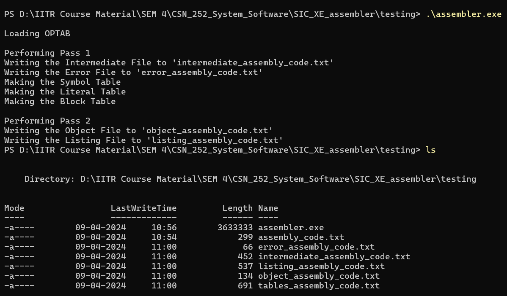

# CSN-252 Project

## Introduction

The objective of this project is to implement a version of two-pass SIC/XE assembler. It supports Program Blocks.

Features implemented:
- Literals
- Expressions
- Assembler Directives
- Symbols
- Program Blocks 


## Design and Working

It is a two-pass assembler which assembles the input program in two passes.

1) Pass 1: 
   
   - The intermediate file is created and updated and the error file is also updated if the need arises. The required symbols are declared in the symbol table. 
   - The actual processing of the input starts when the START symbol is encountered whereas any comments are ignored.
   - The LOCCTR is set as per the value given in the start directive, otherwise it is default initialised to zero. Two nested loops are at the heart of the program and keep executing till the directive END is encountered. 
   - Errors such as duplicate symbols are mentioned in the error file.

2) Pass 2: 
   
   - The second pass acts on the intermediate file generated by pass 1, the file is processed via the readIntermediateFile() function.
   - We then proceed to generate the listing file and the object program. The error file is updated as and when necessary. 
   - The symbol table is used to resolve any issues created when symbols are used as operands. 
   - The various assembler directives are also taken into account while creating the object file.

The following source code files are present in `src` folder. 

- `src/helper_functions.cpp` contains frequently used utlity functions.
- `src/table_structs.cpp` contains various tables and structs used throughout the code.:

```
SYMTAB:
The struct contains information of labels like name, address, block number, a character 
representing whether the label exists in the symbol table or not, an integer representing 
whether label is relative or not.

OPTAB:
The struct contains information of opcode like name, format, a character representing 
whether the opcode is valid or not.

LITTAB:
The struct contains information of literals like its value, address, block number, a character 
representing whether the literal exists in the literal table or not.

REGTAB:
The struct contains information of registers like its numeric equivalent, a character 
representing whether the register exists or not.

BLOCKS:
The struct contains information of blocks like its name, start address, block number, location 
counter value for end address of block, a character representing whether the block exists or not.
```

- `src/pass1.cpp` generates Symbol Table, Intermediate File for the pass2 and also generates error file.

- `src/pass2.cpp` works on the Intermediate File generated by pass1 and generates Listing File and Object Program File

Following files are generated by the assembler :
1.	Object Program
2.	Listing File
3.	Error File
4.	Intermediate File
5.	A file showing various tables created by the Assembler

## Installation

Extract the contents of zip file.

```shell
g++ .\src\pass2.cpp -o .\testing\assembler
```

Now copy the assembly code you wish to assemble in `assembly_code.txt` file of `testing` folder. Some sample assembly codes have been provided in `sample_programs` folder.

```shell
cd testing
.\assembler.exe
```

All output and intermediate files are generated in the same folder.

## Sample Results

1) `sample_code.txt` :

This is question 3 of section 2.2 in the prescribed textbook. As mentioned, the assembler will be tested on this.

```
SUM    START 0
FIRST  LDX   #0
       LDA   #0
       +LDB  #TABLE2
       BASE  TABLE2
LOOP   ADD   TABLE,X
       ADD   TABLE2,X 
       TIX   COUNT
       JLT   LOOP
       +STA  TOTAL
       RSUB
COUNT  RESW  1
TABLE  RESW  2000
TABLE2 RESW  2000
TOTAL  RESW  1
       END   FIRST
```





1) `program_blocks_code.txt` : 
 
This provides a sample code given in the textbook (Fig 2.11) to demonstrate the usage of program blocks.

```
TEST     START   0            
FIRST    STL     RETADR            
CLOOP    JSUB    RDREC             
         LDA     LENGTH            
         COMP    #0                
         JEQ     ENDFIL            
         JSUB    WRREC             
         J       CLOOP             
ENDFIL   LDA     =C'EOF'               
         STA     BUFFER
         LDA     #3            
         STA     LENGTH
         JSUB    WRREC            
         J       @RETADR           
         USE     CDATA                      
RETADR   RESW    1
LENGTH   RESW    1
         USE     CBLKS
BUFFER   RESB    4096              
BUFEND   EQU     *
MAXLEN   EQU     BUFEND-BUFFER
.
.       SUBROUTINE TO READ RECORD INTO BUFFER
.
         USE
RDREC    CLEAR   X              
         CLEAR   A              
         CLEAR   S
         +LDT    #MAXLEN
RLOOP    TD      INPUT             
         JEQ     RLOOP             
         RD      INPUT            
         COMPR   A, S              
         JEQ     EXIT              
         STCH    BUFFER,X          
         TIXR    T            
         JLT     RLOOP            
EXIT     STX     LENGTH            
         RSUB
         USE     CDATA              
INPUT    BYTE    X'F1'             
.
.       SUBROUTINE TO WRITE RECORD FROM BUFFER
.
         USE
WRREC    CLEAR   X            
         LDT     LENGTH
WLOOP    TD      =X'05'        
         JEQ     WLOOP           
         LDCH    BUFFER,X        
         WD      =X'05'          
         TIXR    T            
         JLT     WLOOP             
         RSUB
         USE     CDATA   
         LTORG                  
         END     FIRST
```


1) `csect_code.txt` : 
   
This provides a sample code given in the textbook (Fig 2.15) to demonstrate the usage of control sections. (Tested for showing that it correctly detects errors like wrong opcodes for unsupported features)

```
COPY     START   0  
         EXTDEF  BUFFER, BUFEND, LENGTH 
         EXTREF  RDREC, WRREC         
FIRST    STL     RETADR            
CLOOP    +JSUB   RDREC             
         LDA     LENGTH            
         COMP    #0                
         JEQ     ENDFIL            
         +JSUB    WRREC             
         J       CLOOP             
ENDFIL   LDA     =C'EOF'               
         STA     BUFFER
         LDA     #3            
         STA     LENGTH
         +JSUB   WRREC            
         J       @RETADR           
RETADR   RESW    1
LENGTH   RESW    1
         LTORG
BUFFER   RESB    4096              
BUFEND   EQU     *
MAXLEN   EQU     BUFEND-BUFFER

RDREC    CSECT
.
.       SUBROUTINE TO READ RECORD INTO BUFFER
.
         EXTREF  BUFFER, BUFEND, LENGTH 
         CLEAR   X              
         CLEAR   A              
         CLEAR   S
         LDT     MAXLEN
RLOOP    TD      INPUT             
         JEQ     RLOOP             
         RD      INPUT            
         COMPR   A, S              
         JEQ     EXIT              
         +STCH   BUFFER,X          
         TIXR    T            
         JLT     RLOOP            
EXIT     +STX    LENGTH            
         RSUB
INPUT    BYTE    X'F1'
MAXLEN   WORD    BUFEND-BUFFER  

WRREC    CSECT
.
.       SUBROUTINE TO WRITE RECORD FROM BUFFER
.
         EXTREF  LENGTH, BUFFER
         CLEAR   X            
         +LDT    LENGTH
WLOOP    TD      =X'05'       
         JEQ     WLOOP           
         +LDCH   BUFFER,X        
         WD      =X'05'          
         TIXR    T            
         JLT     WLOOP             
         RSUB
         END     FIRST
```


Two other sample programs `other_program1.txt` and `other_program2.txt` are also provided in the `sample_programs` folder for further testing.